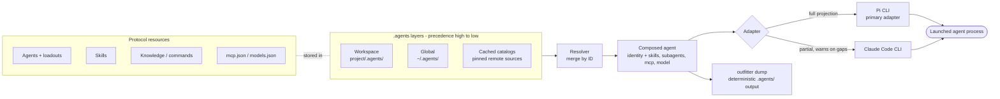
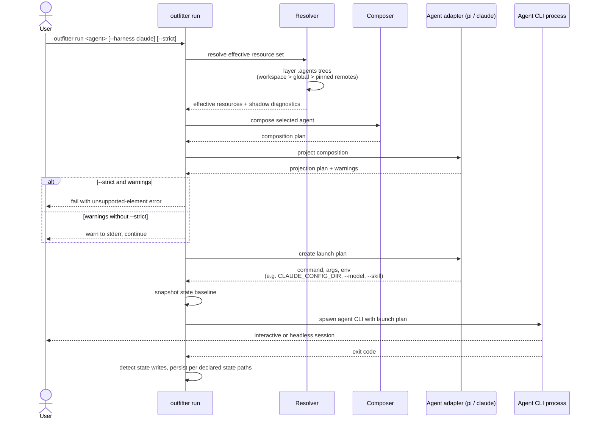
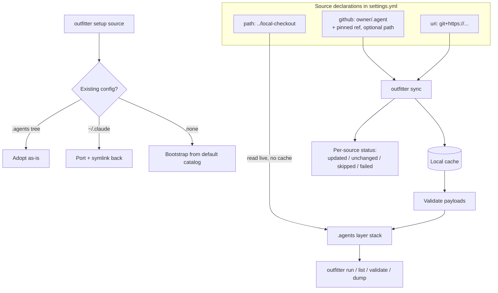

# Architecture diagrams

Mermaid diagrams of how Outfitter turns `.agents` resources into a running agent. Prose definitions live in [concepts](../documentation/concepts.md), per-adapter coverage in the [support matrix](../documentation/support-matrix.md), and the architectural shape in [architecture](./README.md).

## Components: sources to launched agent

Resources come from layered `.agents` trees: the project workspace overlay, the user's global layer, and cached remote catalogs, with higher layers winning by ID. The selected agent composes its loadout by slug from the merged set; the composer builds a harness-neutral composition plan; and an adapter projects that plan into one harness's native files, flags, and environment.

## Sequence: `outfitter run <agent>`

`run` resolves the effective resource set through layer precedence, composes the selected agent, asks the adapter to project the composition into a launch plan, surfaces unprojectable elements as stderr warnings (fatal with `--strict`), and finally spawns the child harness. Declared state paths persist useful agent state across runs.

## Catalog setup and sync

`outfitter setup <source>` adopts an existing `.agents` tree, offers the `~/.claude` port, or bootstraps from a catalog given as a GitHub `owner/repo` shorthand, a git URI, or a local path. `outfitter sync` keeps every remote source current: each `github:`/`uri:` entry is cloned or fast-forwarded into the cache (checked out at `ref` when pinned) and validated before its resources join the layer stack that `run` consumes. Local `path:` sources are read live and never cached.

