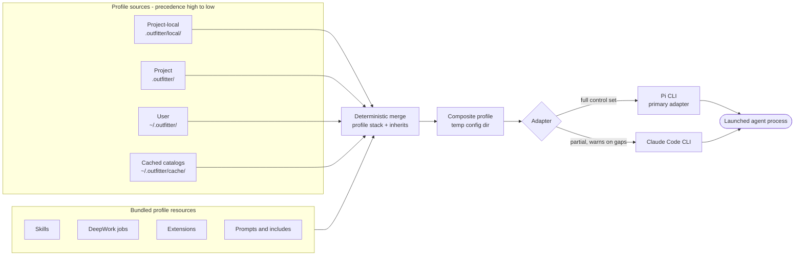
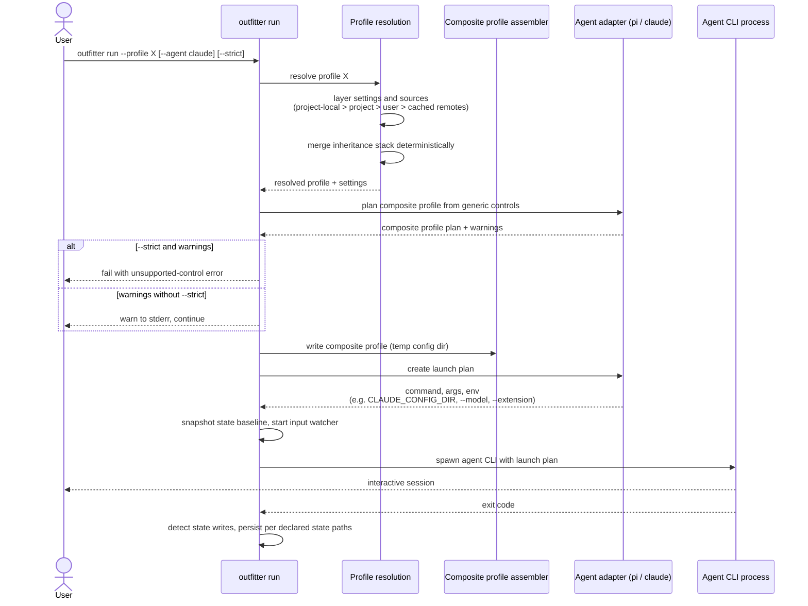
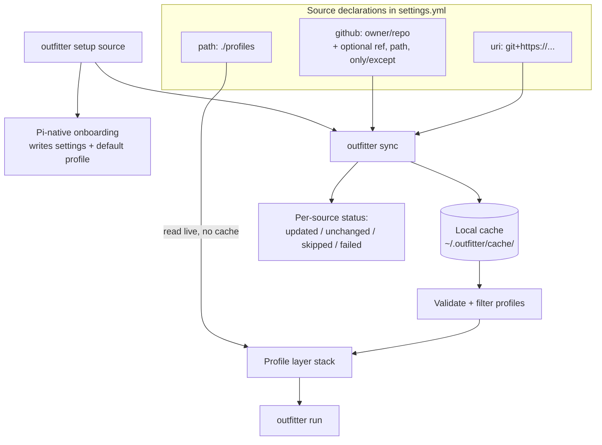

# Architecture diagrams

Mermaid diagrams of how Outfitter turns profile definitions into a running agent CLI. Prose definitions live in [concepts](../documentation/concepts.md), per-adapter coverage in the [support matrix](../documentation/support-matrix.md), and the architectural shape in [architecture](../architecture/README.md).

## Components: sources to launched agent

Profiles come from layered sources: project-local, project, user, and cached remote catalogs, with higher layers winning on conflicts. The selected profile's inheritance stack is merged deterministically into a composite profile — a temporary runtime config directory — which an adapter translates into one agent CLI's native files, flags, and environment. DeepWork jobs, skills, extensions, and prompts travel with profiles as bundled resources and flow through the same generic-controls pipeline.

## Sequence: `outfitter run --profile X`

`run` resolves the profile through layer precedence, assembles the composite profile directory under the system temp dir, asks the adapter to translate generic controls into a launch plan, surfaces untranslatable controls as stderr warnings (fatal with `--strict`), and finally execs the child agent CLI with the assembled config, flags, and environment. A watcher keeps the composite profile refreshed from its inputs while the agent runs, and declared state paths persist useful agent state across runs.

## Catalog setup and sync

`outfitter setup <source>` bootstraps settings and profiles from a catalog given as a GitHub `owner/repo` shorthand, a git URI, or a local path, then hands off to Pi-native onboarding. `outfitter sync` keeps every remote source current: each `github:`/`uri:` entry is cloned or fast-forwarded into `~/.outfitter/cache/` (checked out at `ref` when pinned), validated, and filtered by `only`/`except` before its profiles join the layer stack that `run` consumes. Local `path:` sources are read live and never cached.

