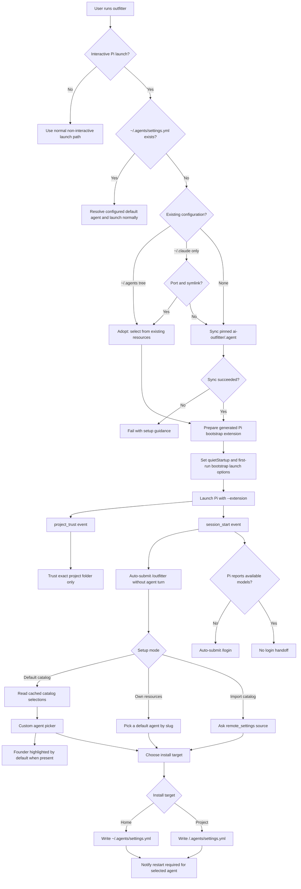

# Onboarding Architecture

## Purpose

This document describes the Pi-native Outfitter onboarding path in the RFC [#165](https://github.com/ai-outfitter/outfitter/issues/165) end state. It is architecture documentation, not product copy: it explains the runtime decisions, generated Pi extension responsibilities, adoption detection, catalog source-of-truth, and custom UI behavior that keep first-run setup native to Pi without requiring an agent/model turn.

## Current First-Run Flow

A plain interactive `outfitter` launch uses Pi-native onboarding only when Outfitter cannot find `~/.agents/settings.yml`. Existing settings use the normal run path. Non-interactive Pi launches (`--print`, `-p`, `--export`, `--list-models`, JSON/print/RPC modes) MUST NOT open onboarding UI, auto-submit slash commands, sync first-run sources, or mutate Outfitter settings.

Before syncing anything, first-run onboarding detects existing configuration:

1. **Existing `~/.agents/` tree without settings** — adopt it: onboarding lists the tree's resolvable agents and skills, helps the user pick a default agent from their own resources by slug, and writes only `settings.yml`. No resources are created, copied, or converted.
2. **Existing `~/.claude` directory and no `~/.agents/` tree** — offer the [port](../documentation/porting-claude.md): move configuration entries into `~/.agents/` and symlink them back so native Claude Code keeps working, then continue as case 1. Declining the port continues as case 3 without touching `~/.claude`.
3. **Neither** — bootstrap from the default catalog.

When bootstrap onboarding is active, `RunCommand` synchronizes the default catalog from `github: ai-outfitter/.agent` (pinned). The generated Pi bootstrap extension receives the synced cache path. The extension reads the catalog's agents and their descriptions from the cached catalog's `settings.yml` and agent frontmatter at runtime; picker entries are not hardcoded in the extension.

Before Pi starts, Outfitter prepares a generated CLI extension and launch environment:

- The generated extension registers `/outfitter` with `pi.registerCommand("outfitter", ...)`.
- The launch plan includes the generated extension with `--extension`.
- First-run onboarding writes Pi `settings.json` with `quietStartup: true` in the bootstrap Pi config directory so Pi startup resource listings stay quiet.
- First-run onboarding injects a temporary bootstrap model argument when needed to avoid Pi's pre-login no-model warning before the extension can open `/login`.
- The extension handles Pi `project_trust` and remembers trust for the exact project folder only. It returns `undecided` for parent folders and all non-first-run launches.

The extension opens `/outfitter` after Pi session start by setting the editor text and submitting Enter through a non-capturing hidden custom UI. This dispatches Pi's native slash command machinery without sending an agent message. If Pi reports no available models through `ctx.modelRegistry.getAvailable()` or equivalent runtime state, the extension renders an Outfitter question box explaining that Pi does not have a model provider connected yet, then opens Pi's native `/login` flow when the user chooses to continue. Outfitter never asks for or stores provider credentials.

## Mermaid Flowchart



## Native Command and Agent-Turn Boundary

`/outfitter` is a Pi extension command, not a prompt sent to the active model. The extension command owns all onboarding UI and filesystem writes. This boundary matters because first-run setup must work before the user has configured model credentials.

The bootstrap extension uses `ctx.ui.setEditorText("/outfitter")` plus a hidden `ctx.ui.custom(...)` component that submits Enter. That lets Pi's slash-command dispatcher run the extension command while avoiding a visible notification that Outfitter is opening setup. The same mechanism opens `/login` only after runtime model availability checks indicate no available models. Before the `/login` handoff, Outfitter SHOULD render a question box that says: "Pi does not have a model provider connected yet. Connect one now so Outfitter can use Pi. Credentials stay inside Pi." This copy SHOULD NOT be emitted as a main-body notification.

## Custom Agent Picker Nuance

Pi's public extension UI selector has a deliberately simple shape:

```ts
ctx.ui.select(title: string, options: string[]): Promise<string | undefined>
```

That API can show a shared title and a flat list of strings, but it cannot attach a per-option description that updates beside the highlighted row. Outfitter therefore uses `ctx.ui.custom(...)` only for the agent picker.

The custom picker uses a purpose-specific custom UI helper named `selectDescribedOption`. The name intentionally avoids a generic `customSelect` label: this component exists for option lists where the highlighted row owns a secondary description. It should be reused for onboarding choices that need per-option explanatory text, including the install-target screen.

The described-option selector renders:

- the fixed agent-setup title and guidance;
- one selectable row per catalog agent;
- only the selected agent's description to the right of that row;
- no description text for agents without a description;
- `↑`/`↓` navigation, Enter selection, and Escape/Ctrl+C cancellation.

The picker initializes on the current configured default agent when one exists. If no current default exists and `founder` is present in the synced catalog, it initializes on `founder` and labels it as recommended. Otherwise it initializes on the first sorted agent. Sorting still keeps `founder` first when present, then sorts remaining agents by id.

Example shape:

```text
Outfitter agent setup

Choose the default agent from the selected catalog for future 'outfitter' launches.
The current Pi process keeps the composition it started with; this setting applies on the next launch.

→ founder — Founder (Recommended)  Founder-operator setup for building, product thinking, research checks, dense prose, and careful delivery.
  data_analyst — Data Analyst
  engineer — Engineer
```

## Setup Modes and Writes

The first onboarding question chooses one setup mode:

1. **Use the default Outfitter catalog** reads the agents from the synced `ai-outfitter/.agent` cache, then writes `default_agent` and the pinned default source to the selected install target's `settings.yml`.
2. **Pick from your own resources** (offered when an adopted or ported tree exists) lists the tree's agents by slug and writes `default_agent` referencing one. It never creates or edits resource files.
3. **Provide a different catalog to import** writes `remote_settings` pointing at the user-provided `owner/repo`, `ref`, and settings path. Before writing, the extension checks GitHub repository metadata. Only HTTP 200 with JSON `private: true` is treated as confirmed private; public, unknown, 403/404, network, malformed, and non-GitHub outcomes do not warn, error, or block.

Private catalog enablement is sourced only from `~/.agents/settings.yml`:

```yaml
enterprise:
  private_catalogs: true
```

If that setting is absent and an imported GitHub catalog is confirmed private, Pi-native onboarding asks:

```text
Private GitHub catalog detected: OWNER/REPO.

Private catalog support is covered by the Outfitter Enterprise license.
Review code/enterprise/LICENSE or your enterprise agreement before enabling.

Enable private catalogs in ~/.agents/settings.yml and use this catalog?
```

The choices are:

```text
Enable and continue
Cancel private catalog setup
```

Accepting writes the home setting and notifies:

```text
Outfitter enabled private catalogs in ~/.agents/settings.yml and saved this catalog.
```

Declining leaves all settings unchanged and notifies:

```text
Private catalog setup was cancelled; no settings were changed.
```

If the home setting is already enabled, onboarding skips the private-catalog enterprise prompt and saves the catalog normally. Outfitter does not collect, echo, persist, synthesize, or validate provider credentials.

The final install target question writes either `~/.agents/settings.yml` or `<project>/.agents/settings.yml`. Selections made after Pi has already started apply to the next `outfitter` launch, so onboarding must communicate that restart boundary. Onboarding never writes `settings.local.yml`; the flat local override file is user-managed.

The install target prompt SHOULD also use `selectDescribedOption`, because the distinction between user-wide and project settings is semantic, not just locational. Required copy:

- Home folder: "These agents will be available anywhere you start outfitter."
- Current project directory: "These agents will only be available in the current project directory and will compose resources of the same slug from the home folder."

If terminal width is too narrow, the selected description SHOULD wrap below the highlighted row rather than truncating the scope explanation.

## Cache and Staleness Implications

The default catalog is a pinned remote source, but the agent picker reads the synchronized local cache passed to the generated extension. If the pinned ref changes upstream, an existing cache can remain stale until sync refreshes it. Seeing a removed agent in the picker usually means the first-run process is reading an old cache or a stuck sync process, not that the generated extension has hardcoded that agent.
