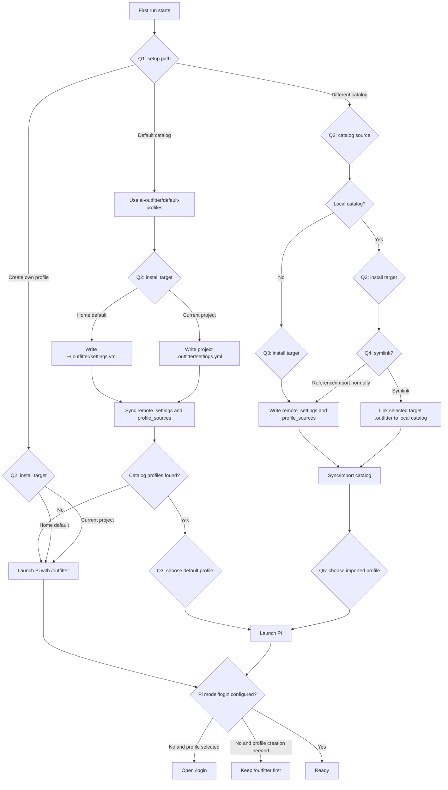

# First-Run Onboarding Architecture

First-run onboarding chooses how Outfitter should create an initial usable Pi configuration. The first question is the setup path, not the default profile picker. Profile choice happens only after a catalog has been selected and loaded.



## Question 1: setup path

This MUST be the first interactive question during first-run setup.

```text
How would you like to set up Outfitter?

1. Use the default Outfitter profile catalog
2. Create your own profile
3. Provide a different catalog to import

Choice [1]:
```

## Question 2: install target

Outfitter SHOULD install into the user home folder by default so the profile is available in every project. The current-project option is for repository-specific setup.

```text
Where should Outfitter install this configuration?

1. Home (~/.outfitter) — available in every project
2. Current project (<project>/.outfitter) — shared with this repository

Install target [1]:
```

## Default Outfitter catalog path

Choosing the default catalog records the shared catalog through `remote_settings`.

```yaml
remote_settings:
  - github: ai-outfitter/default-profiles
    ref: main
    path: settings.yml
```

Outfitter then syncs the catalog and derives profile choices from the loaded profile data. It MUST preserve loaded `id`, `label`, and `description` values. It MUST NOT present a hardcoded role list.

```text
Choose your default profile from the Outfitter catalog:

1. engineer - Engineer
   Engineering setup for repository navigation, maintainable code changes, tests, and reviews.
2. analysis - Analysis
   Analysis setup for source inspection, data reasoning, and clear synthesis.
3. data_analyst - Data Analyst
   Data analysis setup for careful inspection, reproducible methods, assumptions, and summaries.

Default profile [1]:
```

If the default catalog syncs successfully but no profiles are available, Outfitter MUST skip profile installation and launch Pi with `/outfitter` prefilled.

```text
No shared default profiles were found.
Outfitter will open /outfitter inside Pi so you can create or select a profile.
```

## Create-your-own profile path

Choosing `Create your own profile` skips catalog import and launches Pi with `/outfitter` prefilled. The install target still matters because `/outfitter` should write to the selected home or project `.outfitter` folder.

```text
Outfitter will open /outfitter inside Pi so you can create a profile.
```

## Different catalog path

Choosing `Provide a different catalog to import` asks for a GitHub repository, Git URL, or local path.

```text
Enter an Outfitter catalog GitHub repo, Git URL, or local path.

Examples:
  github:my_account/outfitter_config
  https://github.com/my_account/outfitter_config
  /Users/me/work/outfitter_config

Catalog source:
```

For a normal GitHub-backed catalog, Outfitter SHOULD write stable catalog references instead of copying absolute local paths.

```yaml
remote_settings:
  - github: my_account/outfitter_config
    ref: main
    path: settings.yml

profile_sources:
  - github: my_account/outfitter_config
    ref: main
    path: profiles
```

If the input is a local Git checkout and the user does not choose symlink mode, Outfitter SHOULD derive `github`, `ref`, `settings.yml`, and `profiles` from the checkout's remote and branch when possible. If it cannot derive a stable remote reference, it SHOULD ask for one or fall back to a snapshot import with a clear warning.

## Local catalog symlink mode

If the catalog source is a local folder that contains an `.outfitter/` catalog layout, Outfitter SHOULD offer symlink mode after the install target is known. Symlink mode is for live catalog development only: later edits in the local catalog affect later Outfitter runs immediately.

```text
Local catalog detected.

How should Outfitter use this catalog?

1. Reference/import it normally
2. Symlink the target .outfitter to this local catalog for live development

Use symlink only when you are rapidly iterating on a profile catalog.
Symlink mode makes later edits to the local catalog affect future Outfitter runs immediately.

Mode [1]:
```

Symlink mode MUST NOT replace a non-empty target `.outfitter` folder without explicit user confirmation.

## Imported catalog profile choice

After an alternate catalog is loaded, the profile picker uses the imported catalog's profile metadata.

```text
Choose the default profile from this catalog:

1. founder - Founder
   Founder/operator setup for product, engineering, research, and delivery.
2. engineer - Engineer
   Engineering setup for code changes, tests, and reviews.

Default profile [1]:
```

## Pi model/login check

Before launching Pi, Outfitter checks whether native Pi appears to have model/login state, such as `auth.json` or `models.json`. Outfitter MUST NOT collect credentials itself.

When a profile has been selected and Pi has no configured model/login state, Outfitter opens `/login` inside Pi.

```text
Pi does not appear to have a configured model login.
Outfitter will open /login after Pi starts.
```

When the onboarding path needs profile creation or no catalog profile is available, `/outfitter` takes precedence over `/login` because the user must create or select a profile before login guidance is useful.

```text
Outfitter will open /outfitter so you can create or select a profile.
```
