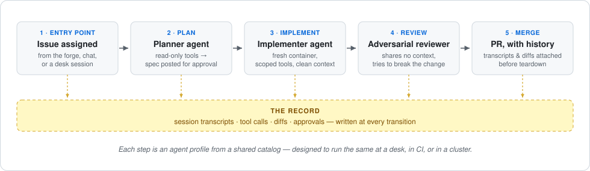

# How AI Outfitter fits together

Open, vendor-neutral tooling for configuring and operating agents: ramp a
user, a team, or an organization from AI-assisted coding to an autonomous
software development lifecycle.

Everything here builds on one convention: an agent's context, tools, skills,
and permissions are plain files in a `.agents/` directory — committed,
reviewed, and shared like the rest of your code. The same plain-file definition
can be shared across environments and model vendors; runtime support varies by
harness, as shown in the
[support matrix](https://github.com/ai-outfitter/outfitter/blob/main/docs/documentation/support-matrix.md).
The core is open source under MIT.

## Why we built AI Outfitter

We built AI Outfitter to give teams a shared path from local agent use to
automated and governed workflows. Its defaults are customizable, so teams can
begin at the rung that matches their current process.

## The adoption ramp

Five rungs, from AI-assisted coding to an autonomous lifecycle
([full definition](https://github.com/ai-outfitter/outfitter/blob/main/docs/philosophy.md)).
Each Outfitter component targets a rung, so you climb without rebuilding what
got you here — and without adopting complexity too early. Rungs 2, 3, and 4
each open with the **runbook** that gets you there: the concrete steps, and a
success check you run rather than judge.

1. **Assisted** — autocomplete and chat; a human's hands stay on the
   keyboard. _You are here if_ you use autocomplete in an IDE.
   There is nothing to govern yet — but the habit that matters starts here:
   document what works and what doesn't in `AGENTS.md`/`CLAUDE.md`, and
   keep it in the repo.
   - [First-time CLI agent users](https://github.com/ai-outfitter/outfitter/blob/main/docs/documentation/first-time-cli-agent-users.md#context-engineering)
     — what belongs in a first `AGENTS.md`, and how to ask an agent to use
     it.

2. **Delegated** — a local agent does the task; you define the idea and
   review the PR. _You are here if_ engineers run a coding agent in a
   terminal and push the result. This is where configuration starts to
   matter.
   - **Runbook: [Share one catalog](https://github.com/ai-outfitter/outfitter/blob/main/docs/runbooks/share-one-catalog.md)**
     — one pinned catalog the organization shares, instead of per-laptop
     configuration.
   - [outfitter](https://github.com/ai-outfitter/outfitter) — composes what
     an agent knows and may do into a **profile**: plain files in your
     `.agents/` folder, reviewed like code and portable across environments
     and **harnesses** (the CLI that runs an agent: Claude Code, Pi, Codex).
   - [deepwork](https://github.com/ai-outfitter/deepwork) — step-by-step
     quality gates so the agent checks its own work.

3. **Automated** — a workflow runs without your laptop: an issue, a message,
   or a schedule triggers agents in CI, on a cluster, or on a remote server
   you never sit at; adversarial review is part of the pipeline; session
   logs are captured before merge. _You are here when_ you close your laptop
   and the work keeps going. What promotes you is the trigger, not the
   hardware: an agent you drive over SSH is rung 2 on a bigger machine.
   - **Runbook: [Run it without your laptop](https://github.com/ai-outfitter/outfitter/blob/main/docs/runbooks/run-without-your-laptop.md)**
     — an event triggers the workflow, its output lands through review, and
     the session is captured.
   - [actions](https://github.com/ai-outfitter/actions) — runs any profile
     headless in GitHub Actions, on any trigger.
   - [channels](https://github.com/ai-outfitter/channels) — pushes email,
     Slack, Signal, and forge events (GitHub or GitLab activity) into an
     agent session, so one message can start the same workflow.
   - [agent-operator](https://github.com/ai-outfitter/agent-operator) —
     hosts the same profiles on your own infrastructure, well before you
     need its resident-agent story on the next rung.

4. **Governed** — the organization shares one version-pinned catalog of
   agents, skills, and policy; every agent action lands in an auditable
   record; **[resident agents](https://github.com/ai-outfitter/outfitter/blob/main/docs/documentation/in-cluster.md)**
   — long-lived agents onboarded like teammates,
   with their own accounts and boundaries — take on standing jobs. _You are
   here when_ agents work across many teams, and the organization needs
   shared policy — and proof of what every agent did.
   - **Runbook: [Give the agent a residence](https://github.com/ai-outfitter/outfitter/blob/main/docs/runbooks/give-the-agent-a-residence.md)**
     — a named, assignable agent with an account and somewhere to live.
   - **Build your agent catalog: [Share one catalog](https://github.com/ai-outfitter/outfitter/blob/main/docs/runbooks/share-one-catalog.md)**
     — the rung 2 runbook creates it and links to guidance on its layout,
     version pinning, and governance. Our own
     [.agents](https://github.com/ai-outfitter/.agents) is a worked example
     you can read end to end.
   - [agent-operator](https://github.com/ai-outfitter/agent-operator) —
     provisions and supervises resident agents on your own infrastructure.
   - [pensieve](https://github.com/ai-outfitter/pensieve) — designed to retain
     evidence from agent sessions, including environments, agents, tools,
     artifacts, and costs. That record can support audits, compliance reviews,
     and evaluation workflows.

5. **Self-improving** — the audit record feeds evals and improvement; humans
   set goals and acceptance gates, agents own the middle. Rung 5 is where
   the stack is thinnest today.
   - [evals](https://github.com/ai-outfitter/evals) — evaluates changes to a
     profile, model, or workflow with reproducible, attested benchmarks.
   - [autoimprove](https://github.com/ai-outfitter/autoimprove) — improves
     portable skills against measured outcomes.

## Start with one workflow end to end

One useful first workflow takes **a feature idea to a merged PR**, automated
end to end, with every step leaving evidence. This is what rung 3 looks like
up close.



1. **Entry point.** Someone files an issue and assigns it to an agent — from
   the forge, from chat, or from a planning session at a desk. Different
   doors, same workflow.
2. **Plan.** A planner profile with read-only tools turns the issue into a
   spec artifact and posts it back to the issue, where a human can approve
   it (we recommend an enforced spec system, like
   [2119](https://github.com/Unsupervisedcom/2119), for more autonomous
   workflows).
3. **Implement.** An implementer profile picks up the approved spec in a
   fresh container with exactly the tools the work needs — a different
   agent, a clean context window, the same shared catalog.
4. **Review.** An adversarial reviewer profile, which shares none of the
   implementer's context, tries to break the change before any human reads
   it.
5. **Merge.** The PR arrives with its history attached: session transcripts,
   tool calls, and diffs captured as artifacts before the environment that
   produced them is torn down.

The same shape handles other starting workflows. A vulnerability report
instead of a feature idea turns the pipeline into governed security
remediation: the scanner files the issue (most scanners already can), the
planner scopes the fix, and the same steps carry it to a tested, approved
PR. Bug reports run the same way with a triage step in front: an agent
reproduces and prioritizes each report, and only the ones that clear triage
enter the pipeline.

Teams adopt the system through the same composition process: an engineer
refines a skill in their own
[`~/.agents`](https://github.com/ai-outfitter/outfitter/blob/main/docs/documentation/local-development.md)
against real work; the team mines
[pensieve](https://github.com/ai-outfitter/pensieve) for the patterns behind
successful and failing runs. When a change earns trust it moves by pull
request into the org catalog, where every agent composes it by name. One
person's improvement becomes everyone's default at the next pin bump — no
one else reconfigures anything.

## Start this afternoon

You can begin with a local assessment and CLI trial before committing to an
organization-wide rollout or additional infrastructure.

### 1. See where you are

The read-only assessment takes one afternoon. The
[org-onboarding runbook](https://github.com/ai-outfitter/outfitter/blob/main/docs/documentation/usecases/org-onboarding-sdlc-report.md)
produces a baseline **SDLC report**: where your organization sits on the
ramp, with evidence, gaps, and next-rung recommendations. Concretely: one
engineer runs the `sdlc-report` skill from their own local agent with a
read-only forge token. It reads through the API — never clones, never
writes — and produces two local files you review before anyone else sees
them. We ran it on this organization the day we wrote this page; the output
is committed at
[.agents/reports/sdlc](https://github.com/ai-outfitter/.agents/tree/main/reports/sdlc),
so you can see exactly what you would get.

### 2. Try the toolchain

The first run takes about ten minutes.

```bash
npx @ai-outfitter/outfitter
```

This launches the Outfitter CLI with the
[Pi](https://github.com/earendil-works/pi) harness bundled and walks you
through composing your first agent profile from a starter catalog. You end
in a working agent session, and everything it created is plain files under
`~/.agents` — which you can read, edit, or delete afterward.

### 3. Automate one workflow

Pick feature-to-PR or bug-to-PR, keep it to
one repository, and promote the profiles you already trust at a desk into
[CI](https://github.com/ai-outfitter/actions). Work the runbooks in order —
[share one catalog](https://github.com/ai-outfitter/outfitter/blob/main/docs/runbooks/share-one-catalog.md),
[run it without your laptop](https://github.com/ai-outfitter/outfitter/blob/main/docs/runbooks/run-without-your-laptop.md),
then [give the agent a residence](https://github.com/ai-outfitter/outfitter/blob/main/docs/runbooks/give-the-agent-a-residence.md).
Each ends with the one concrete step that starts the next.

Every runbook closes with a **Done when** section naming the signals the report
above checks — for this one, `triggered-agents`, `protected-landing`, and
`session-capture`. Re-run the report and it names whichever is still unmet.

## Agent configuration as code

Your agent setup is already configuration: system prompts, skills, MCP
servers, model choices, permissions. Today that configuration lives per tool
and per laptop, gets pasted between repositories, and drifts. Every other
kind of configuration your organization depends on graduated from that stage
years ago — into files, in a repository, behind review.

The [`.agents` convention](https://github.com/ai-outfitter/outfitter/blob/main/docs/documentation/concepts.md#the-agents-protocol)
is an open standard for doing the same for agents:

```text
.agents/
  agents.md            # shared operating context
  system-prompt.md     # base system prompt
  mcp.json             # MCP servers
  models.json          # model configuration
  agents/<id>/agent.md # agent identities + loadouts
  skills/<id>/...      # capability packages
  knowledge/           # reference documents
  commands/            # slash commands
```

Because the configuration is Markdown and JSON, you can read, review, and
audit it with ordinary repository tools. Layers merge by name — a project's
`.agents/` over an engineer's `~/.agents/` over the organization's
**[catalog](https://github.com/ai-outfitter/outfitter/blob/main/docs/documentation/catalogs.md)**,
a shared collection pinned by version — so individuals keep their preferences and
organizations keep their policy
([conventions](https://github.com/ai-outfitter/outfitter/blob/main/docs/documentation/conventions.md)).

Composition beats accumulation. A profile is a selection from those files,
and profiles stack: a personal baseline, a team convention, a project role,
switched as the work changes. That keeps each profile tight, and tight
profiles preserve the context headroom that turns into faster, better
sessions.

The directory is also the exit door. It is the source of truth, and it is
useful without Outfitter. Vendor-neutral cuts in every direction — models,
harnesses, and us. Swap model vendors freely. Run the catalog through any
harness: Pi has the deepest runtime support today, with Claude Code tracked
component by component in the
[support matrix](https://github.com/ai-outfitter/outfitter/blob/main/docs/documentation/support-matrix.md)
— a Claude Code team starts on Claude Code, and the matrix shows the gaps
before you hit them. And if you drop Outfitter itself, the catalog you
built is still yours — plain files, still working.

## Where this is today

Outfitter and several supporting projects are in active development. Actions
and the catalogs run AI Outfitter's own workloads today; rung 5 remains the
least developed part of the stack. Check each linked repository for its current
implementation status.

The model is open core: the convention, the toolchain, and the defaults are
MIT — modules you can rip out and replace — while some advanced capabilities
ship under an enterprise license. If you are evaluating this for an
organization, [open an issue](https://github.com/ai-outfitter/outfitter/issues)
with what you found. The gaps you hit are the roadmap we want.

## As you climb

Two suggestions we make strongly, and follow ourselves:

1. **Automate nothing you have not first done manually.**
2. **Hand over control one layer at a time.**

You never skip a step you don't understand, and nothing you build on one
rung is thrown away on the next.
