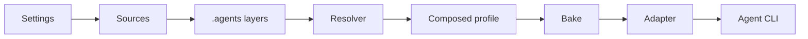

# Concepts

How an `outfitter` launch goes from configuration files to a running agent:



Settings tell Outfitter where `.agents` resources come from; sources supply protocol resource trees; the resolver merges the layered trees into one effective resource set; a profile selects resources from that set by slug; bake freezes the selection into an immutable runnable artifact; and an adapter projects that artifact into agent-specific files, flags, and environment variables before launching the agent CLI.

## The `.agents` protocol

Outfitter stores and exchanges all agent configuration in the vendor-neutral [Dotagents `.agents` protocol](https://dotagentsprotocol.com/) (pinned at revision [`502a9d5`](https://github.com/aj47/dotagentsprotocol-website/blob/502a9d5f886d0aad8d3da83c03354bdfa4b389e7/src/components/Structure.astro)). Outfitter does not define its own authored configuration format: a `.agents/` tree is useful without Outfitter, and any existing `.agents/` tree is usable by Outfitter without conversion.

```text
.agents/
  agents.md            # shared operating context
  system-prompt.md     # base system prompt
  mcp.json             # MCP server configuration
  models.json          # model configuration
  agents/<id>/agent.md # agent definitions (+ optional config.json)
  skills/<id>/...      # Agent Skills packages
  tasks/<id>/task.md   # named execution contracts
  knowledge/...        # reference documents
  commands/...         # slash commands
```

## Resources

The protocol resources Outfitter resolves and composes:

- **Agent** — a definition at `agents/<id>/agent.md` describing an identity and its behavior. One agent definition can serve as a [persona](./personas.md) or a [subagent](./subagents.md). See [Agents](./agents.md).
- **Skill** — a capability package under `skills/<id>/` with instructions, references, scripts, and assets. See [Skills](./skills.md).
- **Task** — a lightweight execution contract at `tasks/<id>/task.md` that selects personas, skills, and optional DeepWork jobs. See [Tasks](./tasks.md).
- **Knowledge** and **commands** — reference documents and slash commands shared across runs.

## Profiles, personas, and subagents

These are three distinct concepts:

- A **[profile](./profiles.md)** is _what you selected_: a named selection of resource slugs — personas, skills, subagents, knowledge — declared in settings or by a task. A profile is not a file format; there is no `profile.yml`.
- A **[persona](./personas.md)** is _who the agent is_: one or more protocol agents composed in explicit order to form the primary identity, policy, and behavioral posture of a run.
- A **[subagent](./subagents.md)** is _who the agent can delegate to_: a protocol agent projected into the harness's native subagent mechanism and invoked from within a run.

The same agent definition can play either role; the profile decides how it is used.

## Layers

Resources resolve across layers, following the protocol's overlay semantics:

1. `<project>/.agents/` — the workspace layer, committed with a project.
2. `~/.agents/` — the global layer for one developer.
3. Remote sources — pinned `.agents` payloads from [catalog repositories](./catalogs.md), in configured order.

Resources merge **by ID**: a workspace `skills/wiki/` overrides a global or remote `skills/wiki/`. JSON files such as `mcp.json` and `models.json` follow the protocol's JSON merge behavior. Standalone `.agents` repositories — where the repository root _is_ the payload — are the primary way to develop and share layers; see [Catalogs](./catalogs.md) and [Local development](./local-development.md).

## Settings scopes

Outfitter's own settings live inside the `.agents` tree as `settings.yml`, with a flat, gitignored `settings.local.yml` beside it for personal machine-local overrides:

- `~/.agents/settings.yml` — user defaults, plus optional `~/.agents/settings.local.yml`.
- `<project>/.agents/settings.yml` — committed project settings.
- `<project>/.agents/settings.local.yml` — personal, uncommitted overrides for that project. This flat file replaces the old nested project-local directory scope.

Settings declare the default profile and agent, named profile selections, resource sources, and launch behavior. Removing the settings files leaves a pure protocol tree. See [Settings](./settings.md).

## One resolver

Listing, validation, task baking, running, and dumping all share one resolver. What `outfitter list` shows is what `outfitter run` launches, what `outfitter task bake` freezes, and what `outfitter dump` writes. See [Dump and bake](./dump-and-bake.md).

## Adapters

An adapter projects composed resources into one agent CLI's native configuration — files, command-line flags, and environment variables. Pi is the primary and most complete adapter; a Claude Code adapter is supported with gaps. When an adapter cannot honor part of a composition it warns to stderr, or fails when `--strict` is set. See the [adapter support matrix](./support-matrix.md).

## State persistence

Agents write state during a run — auth, native settings, plugins, sessions. Each adapter declares the state paths it understands and how writes are handled (`symlink`, `discard`, `warn`, `error`, or `prompt`), so useful state survives future runs. See [State persistence](./state.md).

## Layer precedence

When several layers define the same resource ID or setting, higher layers win:

1. Project-local settings (`<project>/.agents/settings.local.yml`)
2. Project (`<project>/.agents/`)
3. User (`~/.agents/`, with `settings.local.yml` above `settings.yml`)
4. Cached remote sources (in configured source order)
5. Built-in defaults
