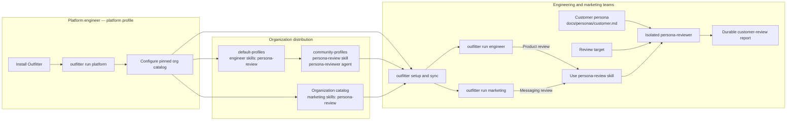

# Persona reviews

A persona review gathers structured feedback on a product, docs, onboarding flow, or UX from the point of view of the people who might use it — before asking real prospects to spend time. It uses the [persona convention](../personas.md): **one shared review agent** plus **one committed Markdown file per persona**. The same file runs under Outfitter, and pastes unchanged into any web agent.

## One persona, one file

The whole persona is one portable, self-contained Markdown document — a generic role archetype, H1 first, no frontmatter, first-person prose. Abridged from the canonical [`platform-lead.md`](https://github.com/ai-outfitter/community-profiles/blob/main/skills/persona-authoring/references/personas/platform-lead.md) reference:

```markdown
# Platform Lead

I'm the platform lead responsible for a consistent, reproducible agent setup
across a mid-sized engineering organization.

## How I decide

I look for clear precedence, pinned sources, documented secret boundaries,
least-privilege access, and tests showing that credentials stay isolated
between layers. I check the escape hatch first.
```

The review method lives in the shared [`persona-reviewer`](https://github.com/ai-outfitter/community-profiles/blob/main/agents/persona-reviewer/agent.md) agent; each persona is a Markdown file you append to it.

## Adopt persona reviews across an engineering organization

A platform engineer installs Outfitter and uses the `platform` profile to
configure a pinned [organization catalog](./organization-profile-catalog.md).
The catalog reuses the default `engineer` profile, defines the organization's
`marketing` profile, and makes the community persona-review components
available to both. After setup and sync, engineers review products from the
`engineer` profile while marketers review messaging from the `marketing`
profile. Both profile loadouts select `persona-review`. When either role is
asked to run a review, the skill launches the isolated shared reviewer with the
selected customer persona and saves the report:



The `platform`, `engineer`, and `marketing` profiles are executable roles. A
customer persona supplies temporary identity context within the isolated
reviewer process.

## Author it

Start from the community catalog's [`template.persona.md`](https://github.com/ai-outfitter/community-profiles/blob/main/skills/persona-authoring/assets/template.persona.md) by hand, or let any agent that selects the [`persona-authoring`](https://github.com/ai-outfitter/community-profiles/tree/main/skills/persona-authoring) skill interview you into the file. Commit the result to normal project documentation:

```text
docs/personas/
  platform-lead.md
  founder-operator.md
```

A persona whose reader exists independently of any one repository goes in `~/.agents/personas/` instead, where every working directory can reach it. See [Where personas live](../personas.md#where-personas-live).

Prefer generic role archetypes over named individuals. Research and interviews are authoring inputs; commit only the self-contained file, and invent nothing the research does not support.

## Run it under Outfitter

After `outfitter setup`, launch the shared reviewer directly with the persona appended and save its output:

```sh
mkdir -p docs/persona-reviews
outfitter run persona-reviewer --append-prompt docs/personas/platform-lead.md -- \
  --print "Review the onboarding flow and write the report. @README.md" \
  > docs/persona-reviews/platform-lead-onboarding.md
```

This is the portable interface for pi and Claude Code: it works from the project containing the persona, does not assume a particular catalog checkout path, and projects `--append-prompt` through the native flag each harness reads. The Codex adapter has no native append flag and warns that the document is dropped. Repeat the option to compose an identity from several documents; see [When one file is not enough](../personas.md#when-one-file-is-not-enough). One shared agent adopts the file as its identity for that session only and writes a first-person, sourced report — evidence cited to the exact page or UI moment, assumptions labeled. The reviewer inherits the caller's configured model; reviews benefit from a strong reasoning model.

### Optional orchestration with the skill

Use the [`persona-review`](https://github.com/ai-outfitter/community-profiles/tree/main/skills/persona-review) skill when another agent should manage the review process. The skill owns synchronous or background execution and durable report capture. From a checkout of the community catalog, its repository-relative launcher is an optional convenience:

```sh
bash skills/persona-review/scripts/persona-review.sh \
  --persona platform-lead \
  --report docs/persona-reviews/platform-lead-onboarding.md \
  -- --print "Review the onboarding flow and write the report. @README.md"
```

A bare `--persona` name resolves against `docs/personas/`, then `.agents/personas/`, then `~/.agents/personas/`, so the same command works whether the persona is project-local or cross-project; pass a path to name a file directly. The reviewer runs directly as the selected agent. This journey does not require Pi's native subagent projection.

## Take the same file to the web

Paste or upload `docs/personas/platform-lead.md` unchanged into a claude.ai project's knowledge or a ChatGPT project and say: "Treat this as stakeholder context. Review the attached landing page from this persona's point of view." The file was written to read standalone, so a tool that takes Markdown project context can use it unchanged.

## Why this shape

- **One file per persona**: adding a persona adds a document, not another agent.
- **Comparable reports**: one agent fixes the review method and output shape, so feedback from different persona files is directly comparable.
- **No Outfitter dependency**: Outfitter is one optional consumer of a file that does not depend on it.

See the [persona spec](../personas.md) for the format, and the community catalog's [persona boundary doc](https://github.com/ai-outfitter/community-profiles/blob/main/docs/persona-review.md) for the responsibility split between authoring, the shared reviewer, and project wrappers.
